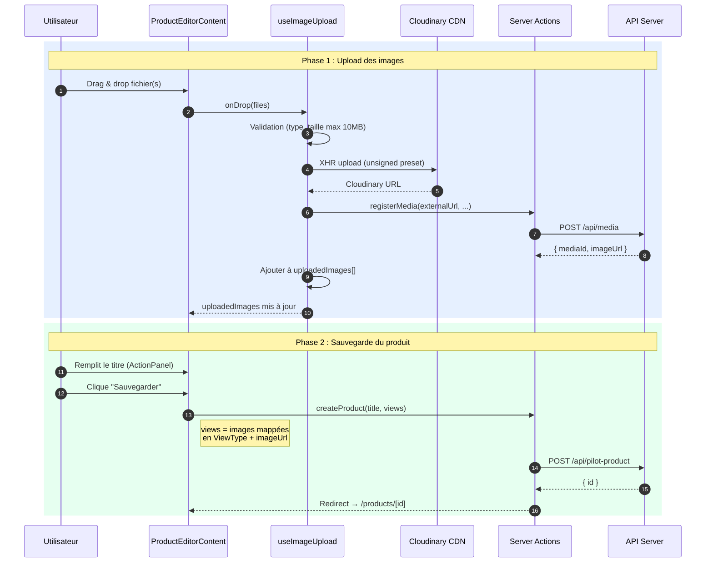
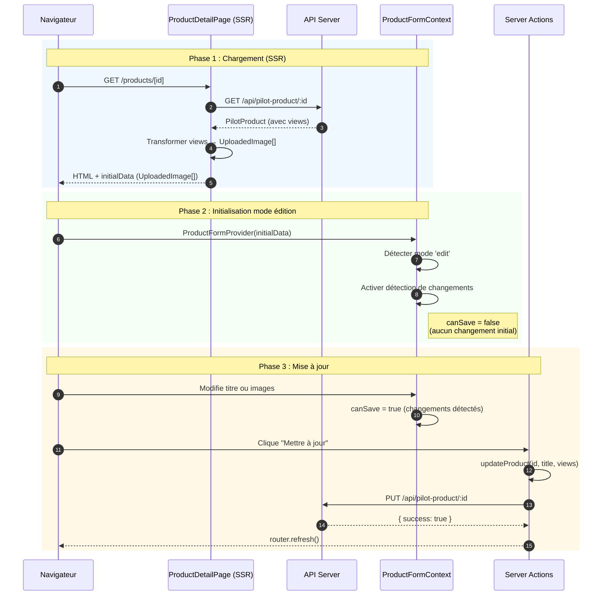
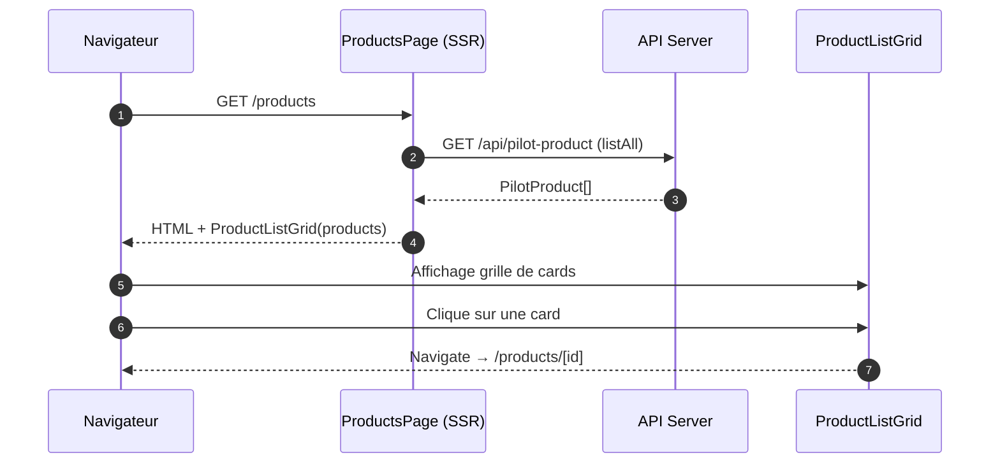

import Tabs from '@theme/Tabs'
import TabItem from '@theme/TabItem'

# Flux de données Client

Ce document décrit les flux utilisateur principaux du back-office : création d'un produit, mise à jour d'un produit existant, et consultation de la liste des produits.

---

## Flux 1 : Création de produit

L'utilisateur crée un nouveau produit en uploadant des images en premier, puis en remplissant le titre et en sauvegardant.



:::tip Ordre des opérations
Les images sont uploadées **avant** la création du produit. Chaque image est indépendamment enregistrée via `POST /api/media` et reçoit un `mediaId`. La création du produit référence ensuite les `imageUrl` des médias enregistrés.
:::

---

## Flux 2 : Mise à jour de produit

L'utilisateur navigue vers un produit existant. La page SSR charge les données, les transforme et les transmet au formulaire client.



---

## Flux 3 : Consultation de la liste

Flux simple de consultation : chargement côté serveur, affichage en grille.



---

## Étapes de transformation

| Étape | Source | Cible | Description |
|-------|--------|-------|-------------|
| Upload image | `File` (navigateur) | Cloudinary URL | Upload direct XHR unsigned vers Cloudinary |
| Enregistrement media | Cloudinary URL | `{ mediaId, imageUrl }` | Server Action → `POST /api/media` |
| Images → Views | `UploadedImage[]` | `View[]` (API) | Mapping `viewType` + `imageUrl` pour la création/mise à jour |
| Views → Images (SSR) | `View[]` (API) | `UploadedImage[]` | Mapping inverse lors du chargement d'un produit existant |

---

## Détails

<Tabs>
  <TabItem value="upload" label="Upload d'image" default>

### useImageUpload — Pipeline détaillé

Le hook `useImageUpload` est implémenté avec **Effect-TS** (style générateurs) pour gérer la séquence asynchrone et les erreurs.

**Validation** :
- Types acceptés : `image/jpeg`, `image/png`, `image/webp`
- Taille maximum : 10 MB
- Rejet immédiat si invalide avec message d'erreur

**Upload Cloudinary** :

```typescript
// Configuration (apps/client/src/lib/config.ts)
{
  cloudName: "dhk8ipori",
  uploadPreset: "maison_amane_dev",
  uploadUrl: `https://api.cloudinary.com/v1_1/dhk8ipori/image/upload`
}
```

L'upload est effectué via `XMLHttpRequest` pour suivre la progression (`upload.onprogress`). L'état `uploadingImages[]` contient les uploads en cours avec leur pourcentage.

**Fichier source** : [`apps/client/src/hooks/useImageUpload.ts`](https://github.com/maison-amane/maison-amane/blob/main/apps/client/src/hooks/useImageUpload.ts)

  </TabItem>
  <TabItem value="create" label="Création produit">

### createProduct — Server Action

Appelée par `ProductFormContext.saveProduct()` quand `mode === 'create'`.

**Données envoyées** :

```typescript
// Transformation : UploadedImage[] → View[]
const views = uploadedImages.map((img, index) => ({
  viewType: index === 0 ? 'FRONT' : index === 1 ? 'DETAIL' : 'ADDITIONAL',
  imageUrl: img.imageUrl,
}))

// Appel API
await client['pilot-product'].create({ title, views })
// → POST /api/pilot-product
```

**Succès** → redirection vers `/products/[id]` (mode édition)

**Fichier source** : [`apps/client/src/app/products/actions.ts`](https://github.com/maison-amane/maison-amane/blob/main/apps/client/src/app/products/actions.ts)

  </TabItem>
  <TabItem value="update" label="Mise à jour produit">

### Chargement SSR + updateProduct

**Chargement SSR** (`/products/[id]/page.tsx`) :

```typescript
const product = await runApiPage(
  client['pilot-product'].getById({ id }),
  { notFoundOn: 'ApiNotFoundError' }
)

// Transformation : views → UploadedImage[]
const initialData = product.views.map(view => ({
  mediaId: generateId(),
  imageUrl: view.imageUrl,
  viewType: view.viewType,
}))
```

**Détection de changements** : `ProductFormContext` compare le titre et les images avec `initialData` à chaque modification. `canSave` devient `true` dès qu'une différence est détectée.

**updateProduct** → `PUT /api/pilot-product/:id` → `router.refresh()` pour recharger les données SSR.

**Fichier source** : [`apps/client/src/contexts/ProductFormContext.tsx`](https://github.com/maison-amane/maison-amane/blob/main/apps/client/src/contexts/ProductFormContext.tsx)

  </TabItem>
  <TabItem value="list" label="Liste produits">

### ProductListGrid — Affichage des cards

La page `/products` est un **composant serveur pur** : pas d'état client, pas de rechargement.

```typescript
// apps/client/src/app/products/page.tsx
const products = await runApiPage(
  client['pilot-product'].listAll()
)
return <ProductListGrid products={products} />
```

**Card** : affiche l'image de type `FRONT` (ou placeholder), le titre, un chip de statut (`DRAFT` / `PUBLISHED` / `ARCHIVED`), et un lien vers `/products/[id]`.

**État vide** : affiche un message avec CTA "Créer un produit".

**Fichier source** : [`apps/client/src/components/product/ProductListGrid.tsx`](https://github.com/maison-amane/maison-amane/blob/main/apps/client/src/components/product/ProductListGrid.tsx)

  </TabItem>
</Tabs>
