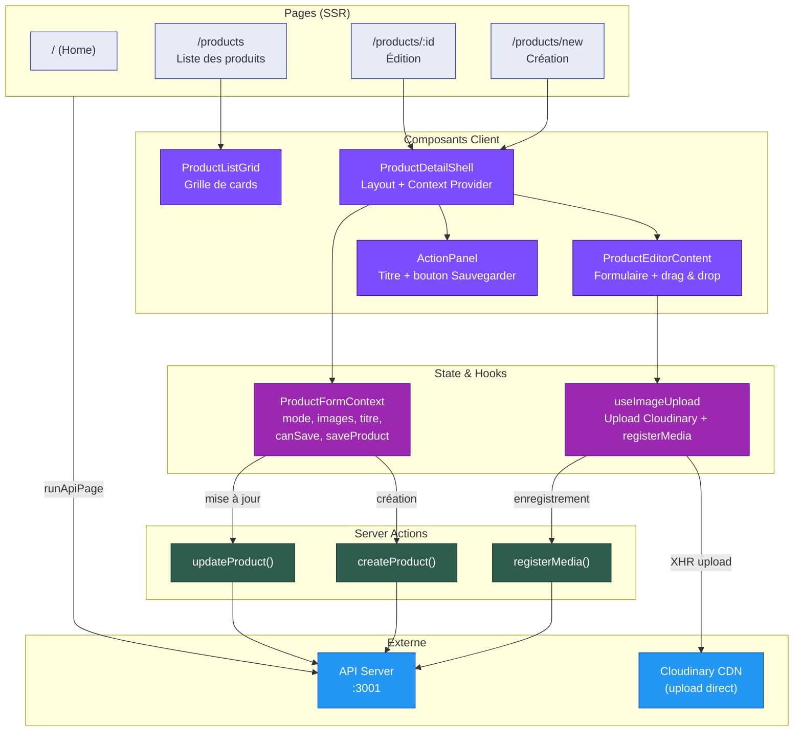
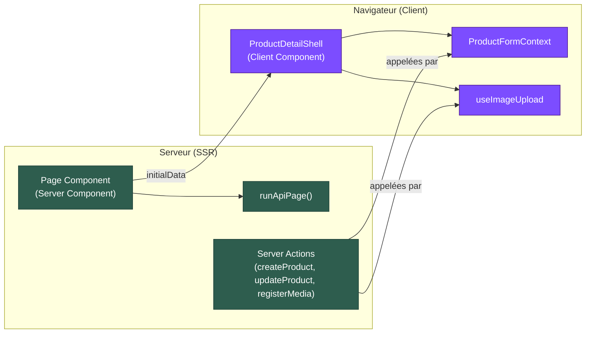

import Tabs from '@theme/Tabs'
import TabItem from '@theme/TabItem'

# Architecture de l'Application Client

L'application client est un **back-office Next.js 16** avec **MUI 7** permettant la gestion des produits : création, mise à jour et upload d'images. Elle communique avec le serveur via des **Server Actions** et le package `@maison-amane/api`.

## Diagramme d'architecture



## Routing

| Route | Composant Page | Type | Description |
|-------|----------------|------|-------------|
| `/` | `app/page.tsx` | Server | Page d'accueil (vide) |
| `/products` | `app/products/page.tsx` | Server | Liste de tous les produits |
| `/products/new` | `app/products/(detail)/new/page.tsx` | Server → Client | Création d'un nouveau produit |
| `/products/[id]` | `app/products/(detail)/[id]/page.tsx` | Server → Client | Édition d'un produit existant |

:::info Pattern Server → Client
Les pages `/products/new` et `/products/[id]` sont des **composants serveur** qui chargent les données initiales, puis délèguent l'interactivité à `ProductDetailShell` (composant client).
:::

---

## Composants

<Tabs>
  <TabItem value="pages" label="Pages (SSR)" default>

Les pages sont des **composants serveur** React. Elles utilisent `runApiPage` pour appeler l'API et transmettre les données aux composants client.

| Page | Données chargées | Comportement d'erreur |
|------|-------------------|----------------------|
| `products/page.tsx` | `listAll()` → tous les produits | Erreur générique |
| `products/(detail)/[id]/page.tsx` | `getById(id)` → un produit | `notFound()` si absent |
| `products/(detail)/new/page.tsx` | Aucune | — |

**Fichier source** : [`apps/client/src/app/products/page.tsx`](https://github.com/maison-amane/maison-amane/blob/main/apps/client/src/app/products/page.tsx)

  </TabItem>
  <TabItem value="components" label="Composants Client">

Les composants client (`'use client'`) gèrent l'interactivité.

| Composant | Rôle | Fichier |
|-----------|------|---------|
| `ProductListGrid` | Grille MUI de cards produits avec image, titre, statut, lien vers détail | [`components/product/ProductListGrid.tsx`](https://github.com/maison-amane/maison-amane/blob/main/apps/client/src/components/product/ProductListGrid.tsx) |
| `ProductDetailShell` | Layout deux colonnes (contenu + ActionPanel), enveloppe `ProductFormProvider` | [`components/product/ProductDetailShell.tsx`](https://github.com/maison-amane/maison-amane/blob/main/apps/client/src/components/product/ProductDetailShell.tsx) |
| `ProductEditorContent` | Zone de drag & drop + galerie d'images uploadées | [`components/product/ProductEditorContent.tsx`](https://github.com/maison-amane/maison-amane/blob/main/apps/client/src/components/product/ProductEditorContent.tsx) |
| `ActionPanel` | Panneau latéral (360px) avec titre TextField, compteur d'images, bouton Sauvegarder | [`components/layout/ActionPanel.tsx`](https://github.com/maison-amane/maison-amane/blob/main/apps/client/src/components/layout/ActionPanel.tsx) |

  </TabItem>
  <TabItem value="state" label="State Management">

### ProductFormContext

Le `ProductFormContext` est le **centre de coordination** du formulaire produit. Il détecte le mode (création ou édition), suit les changements et orchestre la sauvegarde.

**État géré** :

| Propriété | Type | Description |
|-----------|------|-------------|
| `mode` | `'create' \| 'edit'` | Déterminé par la présence d'`initialData` |
| `title` | `string` | Titre du produit |
| `uploadedImages` | `UploadedImage[]` | Images chargées (en cours ou terminées) |
| `canSave` | `boolean` | Titre non vide + au moins 2 images + changements détectés (mode edit) |
| `isSaving` | `boolean` | Sauvegarde en cours |
| `saveError` | `string \| null` | Message d'erreur |
| `saveProduct` | `() => void` | Déclenche `createProduct` ou `updateProduct` |

**Détection de changements (mode edit)** : compare le titre et les images avec `initialData` pour activer `canSave`.

**Fichier source** : [`apps/client/src/contexts/ProductFormContext.tsx`](https://github.com/maison-amane/maison-amane/blob/main/apps/client/src/contexts/ProductFormContext.tsx)

  </TabItem>
  <TabItem value="hooks" label="Hooks">

### useImageUpload

Hook basé sur **Effect-TS** (style générateurs) gérant le cycle de vie complet de l'upload d'images.

**Pipeline** :

```
Drag & Drop (fichier)
    → Validation (type JPEG/PNG/WebP, taille max 10MB)
    → XHR vers Cloudinary (unsigned preset, avec progression)
    → registerMedia Server Action (POST /api/media)
    → Ajout à uploadedImages[]
```

**Retours** :

| Propriété | Type | Description |
|-----------|------|-------------|
| `uploadedImages` | `UploadedImage[]` | Images correctement uploadées et enregistrées |
| `uploadingImages` | `UploadingImage[]` | Uploads en cours avec progression |
| `dragEvents` | objet | Handlers `onDragOver`, `onDrop`, `onDragLeave` |
| `uploadError` | `string \| null` | Erreur de validation ou d'upload |

**Fichier source** : [`apps/client/src/hooks/useImageUpload.ts`](https://github.com/maison-amane/maison-amane/blob/main/apps/client/src/hooks/useImageUpload.ts)

  </TabItem>
</Tabs>

---

## Server Actions

Les Server Actions sont des fonctions Next.js exécutées côté serveur, appelées directement depuis les composants client. Elles servent de pont entre l'UI et l'API.

| Action | API appelée | Retour succès | Retour erreur |
|--------|-------------|---------------|---------------|
| `createProduct()` | `POST /api/pilot-product` | `{ id: string }` | `{ error: string }` |
| `updateProduct(id, data)` | `PUT /api/pilot-product/:id` | `{ success: true }` | `{ error: string }` |
| `registerMedia(data)` | `POST /api/media` | `{ mediaId, imageUrl }` | `{ error: string }` |

:::note Gestion d'erreur
Les Server Actions capturent les erreurs Effect (`Exit.isFailure`) et les convertissent en objets `{ error: string }` pour les afficher dans le formulaire. Aucune exception n'est propagée au client.
:::

**Fichier source** : [`apps/client/src/app/products/actions.ts`](https://github.com/maison-amane/maison-amane/blob/main/apps/client/src/app/products/actions.ts)

---

## Séparation Server / Client



**Règle** : Les composants serveur chargent les données et les passent en props. Les composants client gèrent toute l'interactivité (formulaires, uploads, état local).
