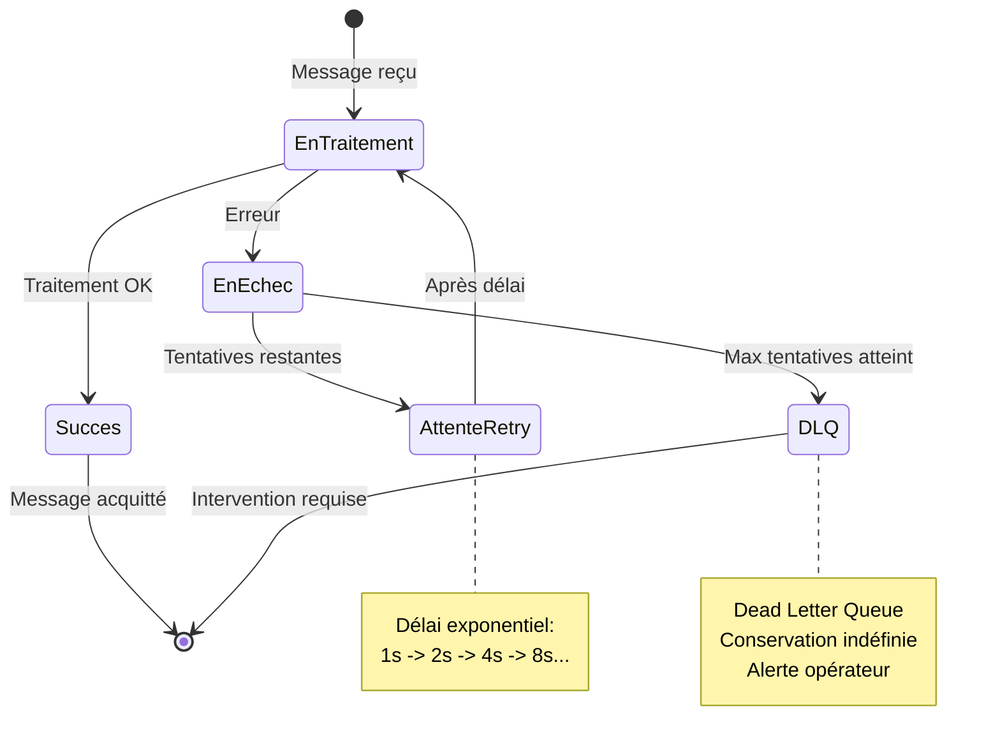
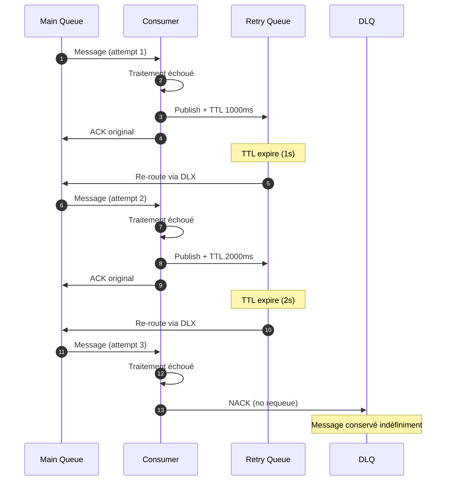
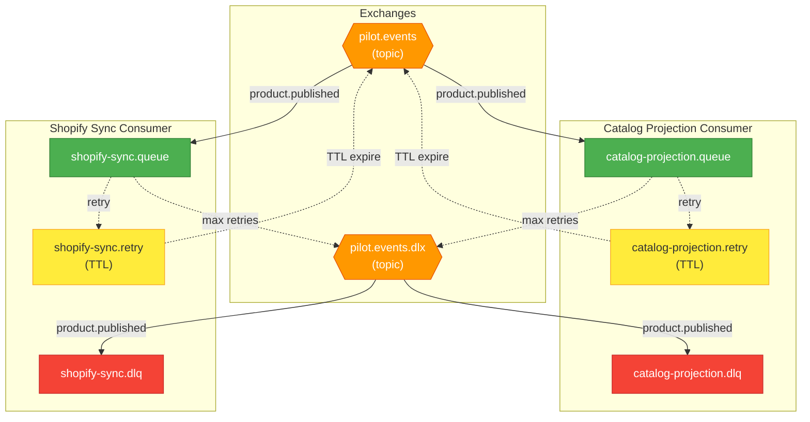

import Tabs from '@theme/Tabs'
import TabItem from '@theme/TabItem'

# Gestion des erreurs

Ce document explique comment le système gère les erreurs lors du traitement des messages. Il est conçu pour être accessible aux équipes non-techniques (PO, QA) tout en fournissant les détails techniques nécessaires aux développeurs.

## Principe général

Quand un produit est publié, des messages sont envoyés aux consumers (Catalog, Shopify). Parfois, le traitement peut échouer :
- Shopify temporairement indisponible
- Erreur de validation inattendue
- Timeout réseau

Le système est conçu pour **ne pas perdre de données** grâce à un mécanisme de retry automatique.

## Le cycle de vie d'un message



## Explication simple (pour PO/QA)

<Tabs>
  <TabItem value="simple" label="Version simple" default>

### Comment ça marche ?

Imaginez un système postal avec plusieurs niveaux de service :

1. **Première tentative** : Le facteur essaie de livrer le colis (le message)
2. **Échec** : Le destinataire n'est pas là (Shopify indisponible)
3. **Retry automatique** : Le colis retourne au dépôt et sera réessayé plus tard
4. **Délai croissant** : À chaque échec, on attend plus longtemps (1s, 2s, 4s, 8s...)
5. **Abandon** : Après 3 tentatives, le colis va aux "objets non délivrés" (DLQ)

### Que se passe-t-il en DLQ ?

Les messages en DLQ ne sont **pas perdus**. Ils attendent une intervention :
- Un développeur peut les analyser
- Une fois le problème corrigé, les messages peuvent être re-traités
- Des alertes sont configurables pour notifier l'équipe

### Impact utilisateur

| Scénario | Impact client | Action requise |
|----------|--------------|----------------|
| Retry réussi | Aucun (transparent) | Aucune |
| Message en DLQ | Produit non visible sur Shopify | Intervention équipe technique |
| Projection Catalog échouée | Produit non visible dans le catalogue | Intervention équipe technique |

  </TabItem>
  <TabItem value="technique" label="Version technique">

### Architecture des queues

Chaque consumer dispose de 3 queues :

| Queue | Rôle | Durée de rétention |
|-------|------|-------------------|
| `{consumer}.queue` | Queue principale de traitement | Jusqu'à acquittement |
| `{consumer}.retry` | Queue temporaire avec TTL | Délai du retry |
| `{consumer}.dlq` | Dead Letter Queue | Indéfinie |

### Flux de retry



### Configuration du retry

| Paramètre | Valeur par défaut | Description |
|-----------|-------------------|-------------|
| `maxAttempts` | 3 | Nombre maximum de tentatives |
| `initialDelayMs` | 1000 | Délai initial (1 seconde) |
| `multiplier` | 2 | Facteur multiplicatif |
| `handlerTimeoutMs` | 30000 | Timeout du handler (30s) |

**Calcul du délai** : `delay = initialDelayMs * (multiplier ^ retryCount)`

| Tentative | Délai |
|-----------|-------|
| 1 | 0ms (immédiate) |
| 2 | 1000ms (1s) |
| 3 | 2000ms (2s) |

**Fichier source** : [`infrastructure/messaging/rabbitmq/consumer.ts`](https://github.com/maison-amane/maison-amane/blob/main/apps/server/src/infrastructure/messaging/rabbitmq/consumer.ts)

  </TabItem>
</Tabs>

---

## Types d'erreurs

### Erreurs récupérables (retry)

Ces erreurs justifient un retry car elles peuvent se résoudre d'elles-mêmes :

| Erreur | Cause probable | Action |
|--------|----------------|--------|
| `MessageTimeoutError` | Shopify lent, réseau congestionné | Retry avec backoff |
| Erreur HTTP 503 | Service temporairement indisponible | Retry avec backoff |
| Erreur HTTP 429 | Rate limiting | Retry avec backoff |
| Erreur réseau | Connexion interrompue | Retry avec backoff |

### Erreurs non-récupérables (DLQ)

Ces erreurs nécessitent une intervention car le retry ne les résoudra pas :

| Erreur | Cause probable | Action |
|--------|----------------|--------|
| `MessageParseError` | Message mal formé | Analyse + correction |
| Erreur HTTP 400 | Données invalides | Correction des données |
| Erreur HTTP 401/403 | Authentification invalide | Vérifier les credentials |

---

## Supervision et alertes

### Métriques à surveiller

| Métrique | Seuil d'alerte | Signification |
|----------|----------------|---------------|
| Messages en DLQ | > 0 | Intervention requise |
| Taux de retry | > 10% | Problème potentiel |
| Latence moyenne | > 5s | Performance dégradée |

### Accès aux messages DLQ

Les messages en DLQ peuvent être consultés via :
1. **RabbitMQ Management UI** : Interface web de RabbitMQ
2. **Logs applicatifs** : Recherche par correlationId
3. **Scripts de monitoring** : Alertes automatiques

---

## Diagramme de topologie RabbitMQ



---

## Procédures opérationnelles

### Que faire quand un message arrive en DLQ ?

1. **Identifier le message** : Utiliser le correlationId dans les logs
2. **Analyser l'erreur** : Consulter les headers du message (x-death)
3. **Corriger le problème** : Selon la nature de l'erreur
4. **Re-traiter si nécessaire** : Republier le message manuellement

### Headers utiles dans les messages DLQ

| Header | Description |
|--------|-------------|
| `x-death` | Historique des échecs (count, reason, queue) |
| `x-first-death-reason` | Raison du premier échec |
| `x-first-death-queue` | Queue d'origine |
| `correlationId` | ID de traçabilité |
| `eventType` | Type d'événement (ex: PilotProductPublished) |

### Exemple de message x-death

```json
{
  "x-death": [
    {
      "count": 3,
      "reason": "rejected",
      "queue": "shopify-sync.queue",
      "time": "2025-01-25T10:30:00Z",
      "exchange": "pilot.events",
      "routing-keys": ["product.published"]
    }
  ]
}
```

---

## FAQ

<details>
<summary>Un message peut-il être traité plusieurs fois ?</summary>

Oui, si le consumer crash après avoir traité le message mais avant de l'acquitter. Les handlers doivent donc être **idempotents** : traiter le même message deux fois doit produire le même résultat.

</details>

<details>
<summary>Combien de temps un message reste-t-il en DLQ ?</summary>

Indéfiniment. Les messages ne sont jamais supprimés automatiquement. C'est une décision opérationnelle de les purger après analyse.

</details>

<details>
<summary>Peut-on changer les paramètres de retry ?</summary>

Oui, via la configuration du consumer. Les paramètres sont définis dans le fichier de configuration RabbitMQ.

**Fichier** : [`composition/config/rabbitmq.config.ts`](https://github.com/maison-amane/maison-amane/blob/main/apps/server/src/composition/config/rabbitmq.config.ts)

</details>

<details>
<summary>Comment tester le comportement de retry ?</summary>

En environnement de dev, vous pouvez :
1. Utiliser le `FakeShopifyClient` qui peut simuler des erreurs
2. Couper temporairement la connexion Shopify
3. Injecter un délai artificiel pour déclencher le timeout

</details>
