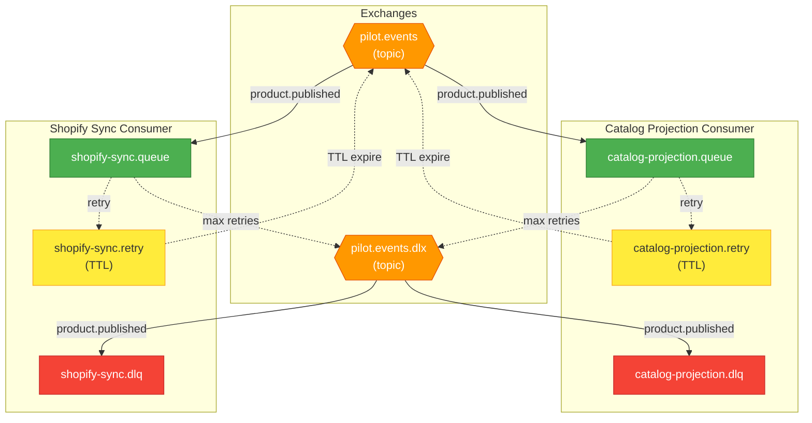

import Tabs from '@theme/Tabs'
import TabItem from '@theme/TabItem'

# Gestion des erreurs

Ce document explique comment le systeme gere les erreurs lors du traitement des messages. Il est concu pour etre accessible aux equipes non-techniques (PO, QA) tout en fournissant les details techniques necessaires aux developpeurs.

## Principe general

Quand un produit est publie, des messages sont envoyes aux consumers (Catalog, Shopify). Parfois, le traitement peut echouer :
- Shopify temporairement indisponible
- Erreur de validation inattendue
- Timeout reseau

Le systeme est concu pour **ne pas perdre de donnees** grace a un mecanisme de retry automatique.

## Le cycle de vie d'un message


## Explication simple (pour PO/QA)

<Tabs>
  <TabItem value="simple" label="Version simple" default>

### Comment ca marche ?

Imaginez un systeme postal avec plusieurs niveaux de service :

1. **Premiere tentative** : Le facteur essaie de livrer le colis (le message)
2. **Echec** : Le destinataire n'est pas la (Shopify indisponible)
3. **Retry automatique** : Le colis retourne au depot et sera reessaye plus tard
4. **Delai croissant** : A chaque echec, on attend plus longtemps (1s, 2s, 4s, 8s...)
5. **Abandon** : Apres 3 tentatives, le colis va aux "objets non delivres" (DLQ)

### Que se passe-t-il en DLQ ?

Les messages en DLQ ne sont **pas perdus**. Ils attendent une intervention :
- Un developpeur peut les analyser
- Une fois le probleme corrige, les messages peuvent etre re-traites
- Des alertes sont configurables pour notifier l'equipe

### Impact utilisateur

| Scenario | Impact client | Action requise |
|----------|--------------|----------------|
| Retry reussi | Aucun (transparent) | Aucune |
| Message en DLQ | Produit non visible sur Shopify | Intervention equipe technique |
| Projection Catalog echouee | Produit non visible dans le catalogue | Intervention equipe technique |

  </TabItem>
  <TabItem value="technique" label="Version technique">

### Architecture des queues

Chaque consumer dispose de 3 queues :

| Queue | Role | Duree de retention |
|-------|------|-------------------|
| `{consumer}.queue` | Queue principale de traitement | Jusqu'a acquittement |
| `{consumer}.retry` | Queue temporaire avec TTL | Delai du retry |
| `{consumer}.dlq` | Dead Letter Queue | Indefinie |

### Flux de retry


### Configuration du retry

| Parametre | Valeur par defaut | Description |
|-----------|-------------------|-------------|
| `maxAttempts` | 3 | Nombre maximum de tentatives |
| `initialDelayMs` | 1000 | Delai initial (1 seconde) |
| `multiplier` | 2 | Facteur multiplicatif |
| `handlerTimeoutMs` | 30000 | Timeout du handler (30s) |

**Calcul du delai** : `delay = initialDelayMs * (multiplier ^ retryCount)`

| Tentative | Delai |
|-----------|-------|
| 1 | 0ms (immediate) |
| 2 | 1000ms (1s) |
| 3 | 2000ms (2s) |

**Fichier source** : [`infrastructure/messaging/rabbitmq/consumer.ts`](https://github.com/maison-amane/maison-amane/blob/main/apps/server/src/infrastructure/messaging/rabbitmq/consumer.ts)

  </TabItem>
</Tabs>

---

## Types d'erreurs

### Erreurs recuperables (retry)

Ces erreurs justifient un retry car elles peuvent se resoudre d'elles-memes :

| Erreur | Cause probable | Action |
|--------|----------------|--------|
| `MessageTimeoutError` | Shopify lent, reseau congestionne | Retry avec backoff |
| Erreur HTTP 503 | Service temporairement indisponible | Retry avec backoff |
| Erreur HTTP 429 | Rate limiting | Retry avec backoff |
| Erreur reseau | Connexion interrompue | Retry avec backoff |

### Erreurs non-recuperables (DLQ)

Ces erreurs necessitent une intervention car le retry ne les resoudra pas :

| Erreur | Cause probable | Action |
|--------|----------------|--------|
| `MessageParseError` | Message mal forme | Analyse + correction |
| Erreur HTTP 400 | Donnees invalides | Correction des donnees |
| Erreur HTTP 401/403 | Authentification invalide | Verifier les credentials |

---

## Supervision et alertes

### Metriques a surveiller

| Metrique | Seuil d'alerte | Signification |
|----------|----------------|---------------|
| Messages en DLQ | > 0 | Intervention requise |
| Taux de retry | > 10% | Probleme potentiel |
| Latence moyenne | > 5s | Performance degradee |

### Acces aux messages DLQ

Les messages en DLQ peuvent etre consultes via :
1. **RabbitMQ Management UI** : Interface web de RabbitMQ
2. **Logs applicatifs** : Recherche par correlationId
3. **Scripts de monitoring** : Alertes automatiques

---

## Diagramme de topologie RabbitMQ



---

## Procedures operationnelles

### Que faire quand un message arrive en DLQ ?

1. **Identifier le message** : Utiliser le correlationId dans les logs
2. **Analyser l'erreur** : Consulter les headers du message (x-death)
3. **Corriger le probleme** : Selon la nature de l'erreur
4. **Re-traiter si necessaire** : Republier le message manuellement

### Headers utiles dans les messages DLQ

| Header | Description |
|--------|-------------|
| `x-death` | Historique des echecs (count, reason, queue) |
| `x-first-death-reason` | Raison du premier echec |
| `x-first-death-queue` | Queue d'origine |
| `correlationId` | ID de tracabilite |
| `eventType` | Type d'evenement (ex: PilotProductPublished) |

### Exemple de message x-death

```json
{
  "x-death": [
    {
      "count": 3,
      "reason": "rejected",
      "queue": "shopify-sync.queue",
      "time": "2025-01-25T10:30:00Z",
      "exchange": "pilot.events",
      "routing-keys": ["product.published"]
    }
  ]
}
```

---

## FAQ

<details>
<summary>Un message peut-il etre traite plusieurs fois ?</summary>

Oui, si le consumer crash apres avoir traite le message mais avant de l'acquitter. Les handlers doivent donc etre **idempotents** : traiter le meme message deux fois doit produire le meme resultat.

</details>

<details>
<summary>Combien de temps un message reste-t-il en DLQ ?</summary>

Indefiniment. Les messages ne sont jamais supprimes automatiquement. C'est une decision operationnelle de les purger apres analyse.

</details>

<details>
<summary>Peut-on changer les parametres de retry ?</summary>

Oui, via la configuration du consumer. Les parametres sont definis dans le fichier de configuration RabbitMQ.

**Fichier** : [`composition/config/rabbitmq.config.ts`](https://github.com/maison-amane/maison-amane/blob/main/apps/server/src/composition/config/rabbitmq.config.ts)

</details>

<details>
<summary>Comment tester le comportement de retry ?</summary>

En environnement de dev, vous pouvez :
1. Utiliser le `FakeShopifyClient` qui peut simuler des erreurs
2. Couper temporairement la connexion Shopify
3. Injecter un delai artificiel pour declencher le timeout

</details>
