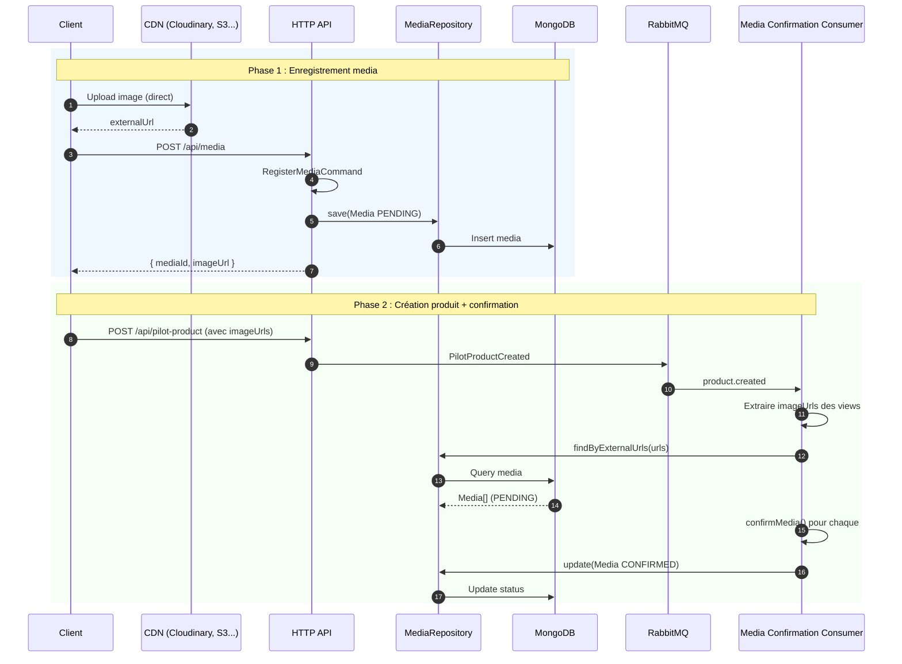
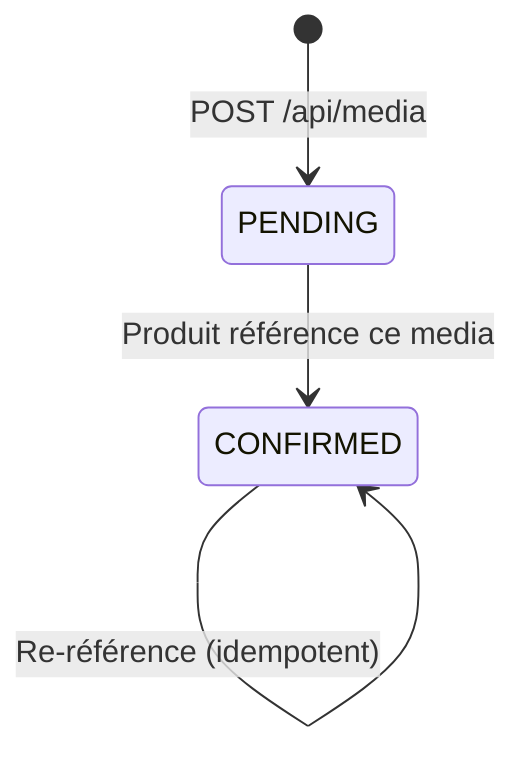

import Tabs from '@theme/Tabs'
import TabItem from '@theme/TabItem'

# Flux d'enregistrement Media

Ce document décrit le flux d'enregistrement des médias (images) et leur confirmation automatique lorsqu'un produit les référence.

## Principe général

L'upload d'images est **découplé** de la création de produit :

1. Les images sont d'abord uploadées vers un CDN externe (ex: Cloudinary, S3)
2. Le backend enregistre la référence (`externalUrl`) via `POST /api/media`
3. Le media reste en statut `PENDING` jusqu'à ce qu'un produit le référence
4. Quand un produit est créé, un consumer confirme automatiquement les médias référencés

Ce découplage permet à d'autres bounded contexts (futurs) de référencer les mêmes médias.

## Vue globale du flux



## Media : cycle de vie



| Statut | Description |
|--------|-------------|
| `PENDING` | Media enregistré, pas encore référencé par un produit |
| `CONFIRMED` | Media référencé par au moins un produit |

## Étapes de transformation

| Étape | Source | Cible | Description |
|-------|--------|-------|-------------|
| 1 | Upload CDN | `externalUrl` | L'image est uploadée directement vers le CDN |
| 2 | `RegisterMediaRequest` | `RegisterMediaCommand` | Extraction des données HTTP |
| 3 | `RegisterMediaCommand` | `Media (PENDING)` | Création de l'agrégat media |
| 4 | `PilotProductCreated` | URLs extraites | Le consumer extrait les imageUrls des views du produit |
| 5 | URLs | `Media (CONFIRMED)` | Chaque media correspondant passe en CONFIRMED |

## Détails

<Tabs>
  <TabItem value="register" label="Enregistrement" default>

### POST /api/media

**Requête** :

```typescript
{
  externalUrl: "https://cdn.example.com/images/tapis-atlas-front.jpg",
  filename: "tapis-atlas-front.jpg",
  mimeType: "image/jpeg",
  fileSize: 245000,
  tags: ["front", "atlas"]    // optionnel
}
```

**Réponse** (201 Created) :

```typescript
{
  mediaId: "550e8400-e29b-41d4-a716-446655440000",
  imageUrl: "https://cdn.example.com/images/tapis-atlas-front.jpg"
}
```

Le media est créé en statut `PENDING`. Le `imageUrl` retourné est l'URL à utiliser dans les `views` du produit lors de sa création.

  </TabItem>
  <TabItem value="confirmation" label="Confirmation automatique">

### Consumer media-confirmation

Le consumer écoute l'événement `PilotProductCreated` (routing key `product.created`).

**Logique** :

1. Extraire toutes les `imageUrl` des views du produit (front, detail, additional)
2. Rechercher les médias correspondants en base (`findByExternalUrls`)
3. Pour chaque media en statut `PENDING`, appeler `confirmMedia()` pour passer en `CONFIRMED`
4. Les médias déjà `CONFIRMED` sont ignorés (idempotent)

**Fichier source** : [`apps/consumers/media-confirmation/src/main.ts`](https://github.com/maison-amane/maison-amane/blob/main/apps/consumers/media-confirmation/src/main.ts)

  </TabItem>
  <TabItem value="model" label="Modèle Media">

### Agrégat Media

```typescript
Media {
  mediaId: MediaId          // UUID v4 (branded)
  externalUrl: MediaUrl     // URL CDN (branded)
  mimeType: MimeType        // ex: "image/jpeg"
  fileSize: FileSize         // en octets
  status: MediaStatus       // PENDING | CONFIRMED
  uploadedAt: Date
  tags: string[]            // tags libres
}
```

**Constructeur** : `makeMedia(params)` — crée un media en statut `PENDING`.

**Méthode** : `confirmMedia(media)` — transition `PENDING` vers `CONFIRMED`. Échoue si déjà confirmé (`MediaAlreadyConfirmedError`).

**Fichier source** : [`apps/server/src/domain/media/aggregate.ts`](https://github.com/maison-amane/maison-amane/blob/main/apps/server/src/domain/media/aggregate.ts)

  </TabItem>
</Tabs>

---

## Intégration avec les produits

Le media est **sans référence directe au produit**. Ce sont les produits qui référencent les médias via les `imageUrl` dans leurs views :

```
PilotProduct.views.front.imageUrl  ──référence──▶  Media.externalUrl
PilotProduct.views.detail.imageUrl ──référence──▶  Media.externalUrl
PilotProduct.views.additional[].imageUrl ──référence──▶  Media.externalUrl
```

Cette conception permet à d'autres bounded contexts de référencer les mêmes médias sans couplage.

:::info Cleanup des médias orphelins
Les médias restés en `PENDING` indéfiniment (non référencés par aucun produit) ne sont pas nettoyés automatiquement. Un job de cleanup est prévu au backlog.
:::
