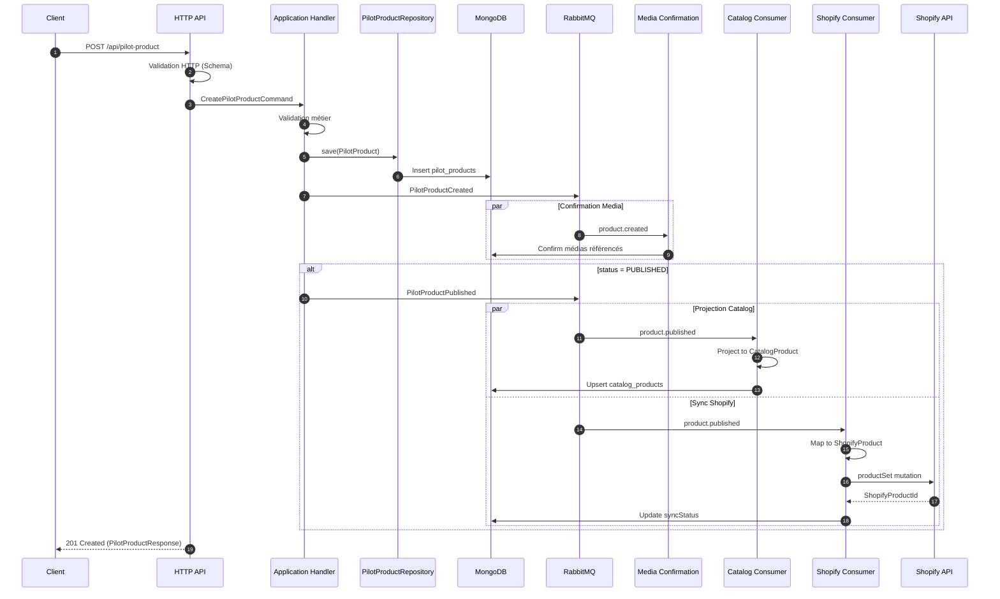
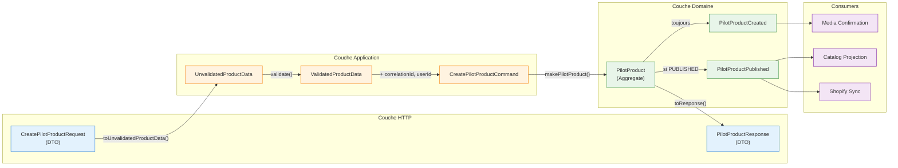

import Tabs from '@theme/Tabs'
import TabItem from '@theme/TabItem'

# Flux Pilot vers Catalog

Ce document décrit le parcours complet des données depuis la création d'un produit via l'API jusqu'à sa projection dans le catalogue et sa synchronisation avec Shopify.

## Vue globale du flux



## Étapes de transformation

Le tableau ci-dessous récapitule chaque étape de transformation des données.

| Étape | Source | Cible | Description |
|-------|--------|-------|-------------|
| 1 | `CreatePilotProductRequest` | `UnvalidatedProductData` | Extraction des données HTTP brutes |
| 2 | `UnvalidatedProductData` | `ValidatedProductData` | Validation des règles métier |
| 3 | `ValidatedProductData` | `PilotProduct` | Construction de l'agrégat |
| 4a | `PilotProduct` | `PilotProductCreated` | Émission (toujours) |
| 4b | `PilotProduct` | `PilotProductPublished` | Émission (si statut PUBLISHED) |
| 5 | `PilotProductCreated` | Media `CONFIRMED` | Confirmation des médias référencés |
| 6 | `PilotProductPublished` | `CatalogProduct` | Projection vers le read model |
| 7 | `PilotProductPublished` | `ShopifyProductSetInput` | Mapping Shopify (voir [détails](./shopify-sync)) |
| 8 | `PilotProduct` | `PilotProductResponse` | Sérialisation de la réponse API |

---

## Détails par étape

<Tabs>
  <TabItem value="step1" label="1. HTTP -> Command" default>

### Étape 1 : Request vers UnvalidatedProductData

**Objectif** : Extraire les données de la requête HTTP sans validation métier.

```typescript
// Entrée: CreatePilotProductRequest (DTO HTTP)
{
  label: "Tapis Berbere Atlas",
  type: "TAPIS",
  category: "STANDARD",
  description: "Tapis traditionnel fait main...",
  priceRange: "PREMIUM",
  variants: [
    { size: "REGULAR" },
    { size: "LARGE" },
    { size: "CUSTOM", customDimensions: { width: 200, length: 300 }, price: 1500 }
  ],
  views: [
    { viewType: "FRONT", imageUrl: "https://..." },
    { viewType: "DETAIL", imageUrl: "https://..." }
  ],
  status: "PUBLISHED"
}

// Sortie: UnvalidatedProductData
// Structure identique mais typée différemment pour indiquer
// que la validation métier n'a pas encore été effectuée
```

**Transformation** : Mapping direct des champs sans modification.

**Fichier** : [`infrastructure/http/mappers/pilot-product.mapper.ts`](https://github.com/maison-amane/maison-amane/blob/main/apps/server/src/infrastructure/http/mappers/pilot-product.mapper.ts) - fonction `toUnvalidatedProductData()`

  </TabItem>
  <TabItem value="step2" label="2. Validation">

### Étape 2 : Validation métier

**Objectif** : Valider les règles métier avant création de l'agrégat.

**Règles validées** :
- Label non vide, longueur maximale
- Au moins une variante
- Vues obligatoires présentes (FRONT, DETAIL)
- Dimensions custom valides (positives)
- Prix custom valide (positif)

```typescript
// Schéma de validation Effect-TS
const ProductDataSchema = S.Struct({
  label: ProductLabelSchema,        // String non vide, max 100 chars
  type: ProductTypeSchema,          // Enum: TAPIS
  category: ProductCategorySchema,  // Enum: RUNNER | STANDARD
  description: ProductDescriptionSchema,
  priceRange: PriceRangeSchema,     // Enum: DISCOUNT | STANDARD | PREMIUM
  variants: S.NonEmptyArray(VariantInputSchema),
  views: ViewsInputSchema,          // Au moins FRONT + DETAIL
  status: ProductStatusSchema,
})
```

**Fichier** : [`application/pilot/validation/product-data.schema.ts`](https://github.com/maison-amane/maison-amane/blob/main/apps/server/src/application/pilot/validation/product-data.schema.ts)

  </TabItem>
  <TabItem value="step3" label="3. Agrégat">

### Étape 3 : Construction de PilotProduct

**Objectif** : Créer l'agrégat racine avec ses invariants.

```typescript
// Construction de l'agrégat
const pilotProduct = makePilotProduct({
  id: generatedProductId,
  label: validatedData.label,
  type: validatedData.type,
  category: validatedData.category,
  description: validatedData.description,
  priceRange: validatedData.priceRange,
  variants: constructedVariants,  // StandardVariant | CustomVariant
  views: {
    front: frontView,
    detail: detailView,
    additional: otherViews,
  },
  status: validatedData.status,
  syncStatus: makeNotSynced(),    // État initial
  createdAt: now,
  updatedAt: now,
})
```

**Invariants de l'agrégat** :
- `variants` ne peut pas être vide (NonEmptyArray)
- `views` doit contenir `front` et `detail`
- `syncStatus` démarre toujours à `NotSynced`

**Fichier** : [`application/pilot/handlers/create-pilot-product.handler.ts`](https://github.com/maison-amane/maison-amane/blob/main/apps/server/src/application/pilot/handlers/create-pilot-product.handler.ts)

  </TabItem>
  <TabItem value="step4" label="4. Événements">

### Étape 4 : Émission des événements domaine

La création d'un produit émet **toujours** `PilotProductCreated`, et **conditionnellement** `PilotProductPublished` si le statut est `PUBLISHED`.

| Événement | Condition | Routing key | Consumers |
|-----------|-----------|-------------|-----------|
| `PilotProductCreated` | Toujours | `product.created` | `media-confirmation` |
| `PilotProductPublished` | `status === PUBLISHED` | `product.published` | `catalog-projection`, `shopify-sync` |

Chaque événement porte le **snapshot complet** du PilotProduct, un `correlationId`, `userId` et `timestamp`.

**Fichier** : [`domain/pilot/events.ts`](https://github.com/maison-amane/maison-amane/blob/main/apps/server/src/domain/pilot/events.ts)

  </TabItem>
  <TabItem value="step5" label="6. Projection Catalog">

### Étape 6 : Projection vers CatalogProduct

**Objectif** : Créer une vue optimisée pour l'affichage catalogue.

**Transformations effectuées** :

| Champ PilotProduct | Champ CatalogProduct | Transformation |
|--------------------|---------------------|----------------|
| `id` | `id` | Direct |
| `label` | `label` | Direct |
| `description` | `description` | Direct |
| `category` | `category` | Direct |
| `priceRange` | `priceRange` | Direct |
| `variants` | `variants` | Simplifié (voir ci-dessous) |
| `views` | `images` | Restructuré (voir ci-dessous) |
| `timestamp` (event) | `publishedAt` | Date de projection |
| - | `shopifyUrl` | Non défini initialement |

**Transformation des variants** :

```typescript
// PilotProduct variant (StandardVariant)
{ _tag: "StandardVariant", size: "REGULAR" }

// CatalogProduct variant
{ _tag: "StandardVariant", size: "REGULAR" }  // Simplifié: pas de CUSTOM size

// PilotProduct variant (CustomVariant)
{ _tag: "CustomVariant", size: "CUSTOM", customDimensions: { width: 200, length: 300 }, price: 1500 }

// CatalogProduct variant
{ _tag: "CustomVariant", dimensions: { width: 200, length: 300 }, price: 1500 }
```

**Transformation des images** :

```typescript
// PilotProduct views
{
  front: { viewType: "FRONT", imageUrl: "https://front.jpg" },
  detail: { viewType: "DETAIL", imageUrl: "https://detail.jpg" },
  additional: [
    { viewType: "BACK", imageUrl: "https://back.jpg" },
    { viewType: "AMBIANCE", imageUrl: "https://ambiance.jpg" }
  ]
}

// CatalogProduct images
{
  front: "https://front.jpg",
  detail: "https://detail.jpg",
  gallery: ["https://back.jpg", "https://ambiance.jpg"]
}
```

**Fichier** : [`application/catalog/projectors/catalog-product.projector.ts`](https://github.com/maison-amane/maison-amane/blob/main/apps/server/src/application/catalog/projectors/catalog-product.projector.ts)

  </TabItem>
  <TabItem value="step6" label="7. Sync Shopify">

### Étape 7 : Mapping vers Shopify

**Objectif** : Transformer le PilotProduct en format compatible Shopify API (mutation `productSet`).

Le mapping convertit les champs du PilotProduct (label, variantes, views, prix) vers le format Shopify (title, handle, productOptions, variants, files). Les prix des StandardVariant sont calculés selon une matrice PriceRange x Size.

Pour le détail complet du mapping, la matrice de prix et la logique du handler, voir [Synchronisation Shopify](./shopify-sync).

  </TabItem>
  <TabItem value="step7" label="8. Response API">

### Étape 8 : Sérialisation de la réponse

**Objectif** : Formater le PilotProduct pour la réponse HTTP.

**Transformations** :
- Dates converties en ISO 8601
- SyncStatus sérialisé selon son tag

```typescript
// Réponse API
{
  id: "550e8400-e29b-41d4-a716-446655440000",
  label: "Tapis Berbere Atlas",
  type: "TAPIS",
  category: "STANDARD",
  description: "Tapis traditionnel fait main...",
  priceRange: "PREMIUM",
  variants: [
    { _tag: "StandardVariant", size: "REGULAR" },
    { _tag: "StandardVariant", size: "LARGE" },
    { _tag: "CustomVariant", size: "CUSTOM", customDimensions: { width: 200, length: 300 }, price: 1500 }
  ],
  views: {
    front: { viewType: "FRONT", imageUrl: "https://..." },
    detail: { viewType: "DETAIL", imageUrl: "https://..." },
    additional: [...]
  },
  status: "PUBLISHED",
  syncStatus: { _tag: "NotSynced" },  // Sync asynchrone, pas encore effectué
  createdAt: "2025-01-25T10:30:00.000Z",
  updatedAt: "2025-01-25T10:30:00.000Z"
}
```

:::info Note sur syncStatus
La réponse API retourne immédiatement avec `syncStatus: NotSynced`. La synchronisation Shopify s'effectue de manière asynchrone via le consumer. Pour connaître le statut de synchronisation, il faut ré-interroger l'API.
:::

**Fichier** : [`infrastructure/http/mappers/pilot-product.mapper.ts`](https://github.com/maison-amane/maison-amane/blob/main/apps/server/src/infrastructure/http/mappers/pilot-product.mapper.ts) - fonction `toResponse()`

  </TabItem>
</Tabs>

---

## Diagramme de transformation des données



## Traçabilité

Chaque flux est tracé grâce au **CorrelationId** :

1. Généré à la réception de la requête HTTP
2. Propagé dans la commande
3. Inclus dans l'événement publié
4. Loggé par chaque consumer

Cela permet de suivre une requête complète dans les logs :

```json
{
  "level": "info",
  "message": "Processing message",
  "correlationId": "550e8400-e29b-41d4-a716-446655440000",
  "consumer": "shopify-sync",
  "productId": "123e4567-e89b-12d3-a456-426614174000"
}
```
