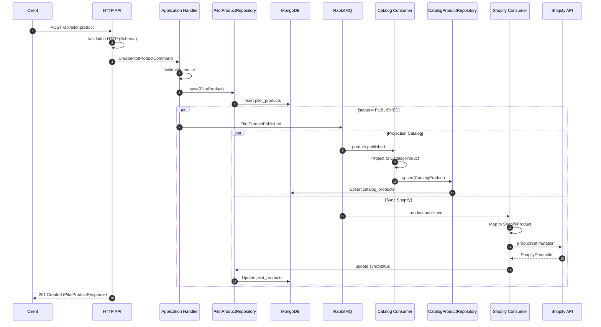
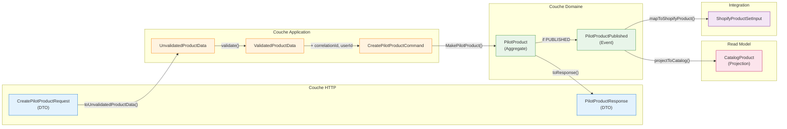

import Tabs from '@theme/Tabs'
import TabItem from '@theme/TabItem'

# Flux Pilot vers Catalog

Ce document decrit le parcours complet des donnees depuis la creation d'un produit via l'API jusqu'a sa projection dans le catalogue et sa synchronisation avec Shopify.

## Vue globale du flux



## Etapes de transformation

Le tableau ci-dessous recapitule chaque etape de transformation des donnees.

| Etape | Source | Cible | Fichier | Description |
|-------|--------|-------|---------|-------------|
| 1 | `CreatePilotProductRequest` | `UnvalidatedProductData` | [`pilot-product.mapper.ts`](https://github.com/maison-amane/maison-amane/blob/main/apps/server/src/infrastructure/http/mappers/pilot-product.mapper.ts#L18) | Extraction des donnees HTTP brutes |
| 2 | `UnvalidatedProductData` | `ValidatedProductData` | [`product-data.schema.ts`](https://github.com/maison-amane/maison-amane/blob/main/apps/server/src/application/pilot/validation/product-data.schema.ts) | Validation des regles metier |
| 3 | `ValidatedProductData` | `PilotProduct` | [`create-pilot-product.handler.ts`](https://github.com/maison-amane/maison-amane/blob/main/apps/server/src/application/pilot/handlers/create-pilot-product.handler.ts) | Construction de l'agregat |
| 4 | `PilotProduct` | `PilotProductPublished` | [`events.ts`](https://github.com/maison-amane/maison-amane/blob/main/apps/server/src/domain/pilot/events.ts) | Emission de l'evenement domaine |
| 5 | `PilotProductPublished` | `CatalogProduct` | [`catalog-product.projector.ts`](https://github.com/maison-amane/maison-amane/blob/main/apps/server/src/application/catalog/projectors/catalog-product.projector.ts) | Projection vers le read model |
| 6 | `PilotProduct` | `ShopifyProductSetInput` | [`shopify-product.mapper.ts`](https://github.com/maison-amane/maison-amane/blob/main/apps/server/src/application/shopify/mappers/shopify-product.mapper.ts) | Mapping vers le format Shopify |
| 7 | `PilotProduct` | `PilotProductResponse` | [`pilot-product.mapper.ts`](https://github.com/maison-amane/maison-amane/blob/main/apps/server/src/infrastructure/http/mappers/pilot-product.mapper.ts#L99) | Serialisation de la reponse API |

---

## Details par etape

<Tabs>
  <TabItem value="step1" label="1. HTTP -> Command" default>

### Etape 1 : Request vers UnvalidatedProductData

**Objectif** : Extraire les donnees de la requete HTTP sans validation metier.

```typescript
// Entree: CreatePilotProductRequest (DTO HTTP)
{
  label: "Tapis Berbere Atlas",
  type: "TAPIS",
  category: "STANDARD",
  description: "Tapis traditionnel fait main...",
  priceRange: "PREMIUM",
  variants: [
    { size: "REGULAR" },
    { size: "LARGE" },
    { size: "CUSTOM", customDimensions: { width: 200, length: 300 }, price: 1500 }
  ],
  views: [
    { viewType: "FRONT", imageUrl: "https://..." },
    { viewType: "DETAIL", imageUrl: "https://..." }
  ],
  status: "PUBLISHED"
}

// Sortie: UnvalidatedProductData
// Structure identique mais typee differemment pour indiquer
// que la validation metier n'a pas encore ete effectuee
```

**Transformation** : Mapping direct des champs sans modification.

**Fichier** : [`infrastructure/http/mappers/pilot-product.mapper.ts`](https://github.com/maison-amane/maison-amane/blob/main/apps/server/src/infrastructure/http/mappers/pilot-product.mapper.ts) - fonction `toUnvalidatedProductData()`

  </TabItem>
  <TabItem value="step2" label="2. Validation">

### Etape 2 : Validation metier

**Objectif** : Valider les regles metier avant creation de l'agregat.

**Regles validees** :
- Label non vide, longueur maximale
- Au moins une variante
- Vues obligatoires presentes (FRONT, DETAIL)
- Dimensions custom valides (positives)
- Prix custom valide (positif)

```typescript
// Schema de validation Effect-TS
const ProductDataSchema = S.Struct({
  label: ProductLabelSchema,        // String non vide, max 100 chars
  type: ProductTypeSchema,          // Enum: TAPIS
  category: ProductCategorySchema,  // Enum: RUNNER | STANDARD
  description: ProductDescriptionSchema,
  priceRange: PriceRangeSchema,     // Enum: DISCOUNT | STANDARD | PREMIUM
  variants: S.NonEmptyArray(VariantInputSchema),
  views: ViewsInputSchema,          // Au moins FRONT + DETAIL
  status: ProductStatusSchema,
})
```

**Fichier** : [`application/pilot/validation/product-data.schema.ts`](https://github.com/maison-amane/maison-amane/blob/main/apps/server/src/application/pilot/validation/product-data.schema.ts)

  </TabItem>
  <TabItem value="step3" label="3. Agregat">

### Etape 3 : Construction de PilotProduct

**Objectif** : Creer l'agregat racine avec ses invariants.

```typescript
// Construction de l'agregat
const pilotProduct = MakePilotProduct({
  id: generatedProductId,
  label: validatedData.label,
  type: validatedData.type,
  category: validatedData.category,
  description: validatedData.description,
  priceRange: validatedData.priceRange,
  variants: constructedVariants,  // StandardVariant | CustomVariant
  views: {
    front: frontView,
    detail: detailView,
    additional: otherViews,
  },
  status: validatedData.status,
  syncStatus: MakeNotSynced(),    // Etat initial
  createdAt: now,
  updatedAt: now,
})
```

**Invariants de l'agregat** :
- `variants` ne peut pas etre vide (NonEmptyArray)
- `views` doit contenir `front` et `detail`
- `syncStatus` demarre toujours a `NotSynced`

**Fichier** : [`application/pilot/handlers/create-pilot-product.handler.ts`](https://github.com/maison-amane/maison-amane/blob/main/apps/server/src/application/pilot/handlers/create-pilot-product.handler.ts)

  </TabItem>
  <TabItem value="step4" label="4. Evenement">

### Etape 4 : Emission de PilotProductPublished

**Objectif** : Notifier le systeme qu'un produit a ete publie.

**Condition** : L'evenement n'est emis que si `status === PUBLISHED`.

```typescript
// Structure de l'evenement
const event = MakePilotProductPublished({
  productId: product.id,
  product: product,           // Snapshot complet du PilotProduct
  correlationId: command.correlationId,
  userId: command.userId,
  timestamp: command.timestamp,
})

// Publication vers RabbitMQ
await eventPublisher.publish(event)
// Routing key: "product.published"
// Exchange: "pilot.events"
```

**Fichier** : [`domain/pilot/events.ts`](https://github.com/maison-amane/maison-amane/blob/main/apps/server/src/domain/pilot/events.ts)

  </TabItem>
  <TabItem value="step5" label="5. Projection Catalog">

### Etape 5 : Projection vers CatalogProduct

**Objectif** : Creer une vue optimisee pour l'affichage catalogue.

**Transformations effectuees** :

| Champ PilotProduct | Champ CatalogProduct | Transformation |
|--------------------|---------------------|----------------|
| `id` | `id` | Direct |
| `label` | `label` | Direct |
| `description` | `description` | Direct |
| `category` | `category` | Direct |
| `priceRange` | `priceRange` | Direct |
| `variants` | `variants` | Simplifie (voir ci-dessous) |
| `views` | `images` | Restructure (voir ci-dessous) |
| `timestamp` (event) | `publishedAt` | Date de projection |
| - | `shopifyUrl` | Non defini initialement |

**Transformation des variants** :

```typescript
// PilotProduct variant (StandardVariant)
{ _tag: "StandardVariant", size: "REGULAR" }

// CatalogProduct variant
{ _tag: "StandardVariant", size: "REGULAR" }  // Simplifie: pas de CUSTOM size

// PilotProduct variant (CustomVariant)
{ _tag: "CustomVariant", size: "CUSTOM", customDimensions: { width: 200, length: 300 }, price: 1500 }

// CatalogProduct variant
{ _tag: "CustomVariant", dimensions: { width: 200, length: 300 }, price: 1500 }
```

**Transformation des images** :

```typescript
// PilotProduct views
{
  front: { viewType: "FRONT", imageUrl: "https://front.jpg" },
  detail: { viewType: "DETAIL", imageUrl: "https://detail.jpg" },
  additional: [
    { viewType: "BACK", imageUrl: "https://back.jpg" },
    { viewType: "AMBIANCE", imageUrl: "https://ambiance.jpg" }
  ]
}

// CatalogProduct images
{
  front: "https://front.jpg",
  detail: "https://detail.jpg",
  gallery: ["https://back.jpg", "https://ambiance.jpg"]
}
```

**Fichier** : [`application/catalog/projectors/catalog-product.projector.ts`](https://github.com/maison-amane/maison-amane/blob/main/apps/server/src/application/catalog/projectors/catalog-product.projector.ts)

  </TabItem>
  <TabItem value="step6" label="6. Sync Shopify">

### Etape 6 : Mapping vers Shopify

**Objectif** : Transformer le PilotProduct en format compatible Shopify API.

**Transformations effectuees** :

| Champ PilotProduct | Champ Shopify | Transformation |
|--------------------|---------------|----------------|
| `label` | `title` | Direct |
| `description` | `descriptionHtml` | Direct |
| `label` | `handle` | Slugifie (ex: "Tapis Berbere" -> "tapis-berbere") |
| `type` + `category` | `productType` | Concatene (ex: "TAPIS - STANDARD") |
| - | `vendor` | "Maison Amane" (constante) |
| - | `status` | "ACTIVE" (produit publie) |
| `priceRange`, `category` | `tags` | Array de tags |
| `variants` | `productOptions` | Option "Dimensions" avec valeurs |
| `variants` | `variants` | Prix + dimensions formatees |
| `views` | `files` | URLs des images |

**Calcul des prix** :

Pour les StandardVariant, le prix est calcule selon la matrice :

| PriceRange | REGULAR | LARGE |
|------------|---------|-------|
| DISCOUNT | 400 | 600 |
| STANDARD | 600 | 900 |
| PREMIUM | 900 | 1400 |

Pour les CustomVariant, le prix est celui defini manuellement.

**Format des dimensions** :

```typescript
// StandardVariant: utilise les dimensions de reference
// Ex: STANDARD + REGULAR -> "140x200"

// CustomVariant: dimensions personnalisees
// Ex: width=200, length=300 -> "200x300"
```

**Fichier** : [`application/shopify/mappers/shopify-product.mapper.ts`](https://github.com/maison-amane/maison-amane/blob/main/apps/server/src/application/shopify/mappers/shopify-product.mapper.ts)

  </TabItem>
  <TabItem value="step7" label="7. Response API">

### Etape 7 : Serialisation de la reponse

**Objectif** : Formater le PilotProduct pour la reponse HTTP.

**Transformations** :
- Dates converties en ISO 8601
- SyncStatus serialise selon son tag

```typescript
// Reponse API
{
  id: "550e8400-e29b-41d4-a716-446655440000",
  label: "Tapis Berbere Atlas",
  type: "TAPIS",
  category: "STANDARD",
  description: "Tapis traditionnel fait main...",
  priceRange: "PREMIUM",
  variants: [
    { _tag: "StandardVariant", size: "REGULAR" },
    { _tag: "StandardVariant", size: "LARGE" },
    { _tag: "CustomVariant", size: "CUSTOM", customDimensions: { width: 200, length: 300 }, price: 1500 }
  ],
  views: {
    front: { viewType: "FRONT", imageUrl: "https://..." },
    detail: { viewType: "DETAIL", imageUrl: "https://..." },
    additional: [...]
  },
  status: "PUBLISHED",
  syncStatus: { _tag: "NotSynced" },  // Sync asynchrone, pas encore effectue
  createdAt: "2025-01-25T10:30:00.000Z",
  updatedAt: "2025-01-25T10:30:00.000Z"
}
```

:::info Note sur syncStatus
La reponse API retourne immediatement avec `syncStatus: NotSynced`. La synchronisation Shopify s'effectue de maniere asynchrone via le consumer. Pour connaitre le statut de synchronisation, il faut re-interroger l'API.
:::

**Fichier** : [`infrastructure/http/mappers/pilot-product.mapper.ts`](https://github.com/maison-amane/maison-amane/blob/main/apps/server/src/infrastructure/http/mappers/pilot-product.mapper.ts) - fonction `toResponse()`

  </TabItem>
</Tabs>

---

## Diagramme de transformation des donnees



## Tracabilite

Chaque flux est trace grace au **CorrelationId** :

1. Genere a la reception de la requete HTTP
2. Propage dans la commande
3. Inclus dans l'evenement publie
4. Log par chaque consumer

Cela permet de suivre une requete complete dans les logs :

```json
{
  "level": "info",
  "message": "Processing message",
  "correlationId": "550e8400-e29b-41d4-a716-446655440000",
  "consumer": "shopify-sync",
  "productId": "123e4567-e89b-12d3-a456-426614174000"
}
```
