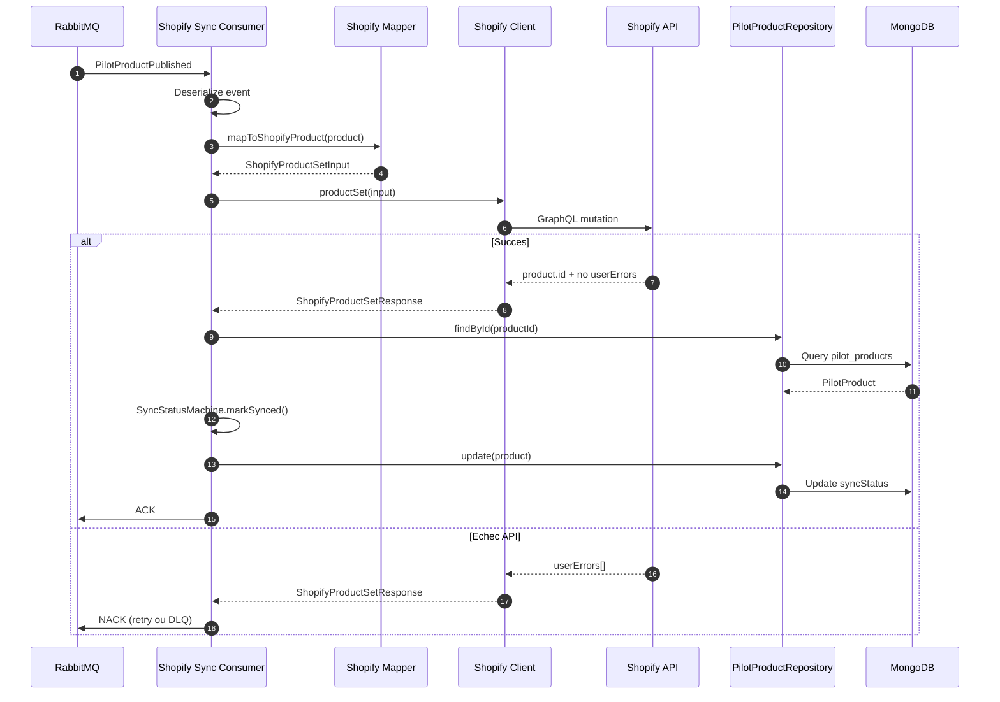
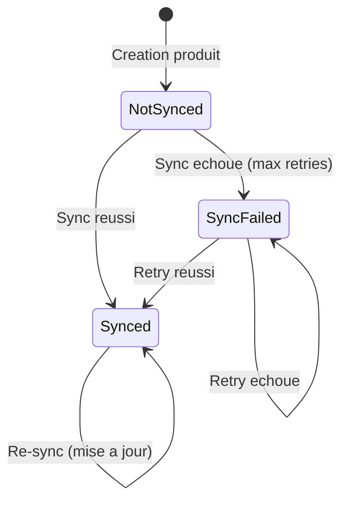

import Tabs from '@theme/Tabs'
import TabItem from '@theme/TabItem'

# Flux de synchronisation Shopify

Ce document decrit le flux de synchronisation des produits vers la plateforme Shopify. Ce flux reagit au meme evenement `PilotProductPublished` que la projection Catalog, mais effectue une integration externe.

## Vue globale



## Architecture du consumer

Le consumer `shopify-sync` est un processus independant qui :

1. Ecoute les evenements `PilotProductPublished` sur RabbitMQ
2. Transforme le PilotProduct en format Shopify
3. Appelle l'API Shopify (mutation `productSet`)
4. Met a jour le `syncStatus` du PilotProduct

```
┌─────────────────────────────────────────────────────────────┐
│                  shopify-sync Consumer                       │
├─────────────────────────────────────────────────────────────┤
│                                                              │
│  ┌──────────────┐    ┌──────────────┐    ┌──────────────┐   │
│  │   RabbitMQ   │───▶│   Handler    │───▶│   Shopify    │   │
│  │   Consumer   │    │              │    │   Client     │   │
│  └──────────────┘    └──────┬───────┘    └──────────────┘   │
│                             │                                │
│                      ┌──────▼───────┐                        │
│                      │   MongoDB    │                        │
│                      │  (syncStatus)│                        │
│                      └──────────────┘                        │
│                                                              │
└─────────────────────────────────────────────────────────────┘
```

**Fichier source** : [`apps/consumers/shopify-sync/src/main.ts`](https://github.com/maison-amane/maison-amane/blob/main/apps/consumers/shopify-sync/src/main.ts)

## Etapes de transformation

| Etape | Source | Cible | Fichier | Description |
|-------|--------|-------|---------|-------------|
| 1 | `PilotProductPublished` | Event deserialise | [`consumer.ts`](https://github.com/maison-amane/maison-amane/blob/main/apps/server/src/infrastructure/messaging/rabbitmq/consumer.ts) | Deserialisation du message RabbitMQ |
| 2 | `PilotProduct` | `ShopifyProductSetInput` | [`shopify-product.mapper.ts`](https://github.com/maison-amane/maison-amane/blob/main/apps/server/src/application/shopify/mappers/shopify-product.mapper.ts) | Mapping vers le format Shopify |
| 3 | `ShopifyProductSetInput` | `ShopifyProductSetResponse` | [`shopify-client.ts`](https://github.com/maison-amane/maison-amane/blob/main/apps/server/src/ports/driven/services/shopify-client.ts) | Appel API Shopify |
| 4 | `SyncStatus` | `Synced` | [`shopify-sync.handler.ts`](https://github.com/maison-amane/maison-amane/blob/main/apps/server/src/application/shopify/handlers/shopify-sync.handler.ts) | Mise a jour du statut |

---

## Details du mapping

<Tabs>
  <TabItem value="mapping" label="Mapping PilotProduct → Shopify" default>

### Correspondance des champs

| PilotProduct | ShopifyProductSetInput | Transformation |
|--------------|------------------------|----------------|
| `label` | `title` | Direct |
| `description` | `descriptionHtml` | Direct |
| `label` | `handle` | Slugification (ex: "Tapis Berbere" → "tapis-berbere") |
| `type` + `category` | `productType` | Concatenation (ex: "TAPIS - STANDARD") |
| - | `vendor` | Constante "Maison Amane" |
| - | `status` | "ACTIVE" pour les produits publies |
| `priceRange`, `category` | `tags` | Array de tags |
| `variants` | `productOptions` | Option unique "Dimensions" |
| `variants` | `variants` | Prix + dimensions |
| `views.*` | `files` | URLs des images |

### Exemple de transformation

```typescript
// Entree: PilotProduct
{
  label: "Tapis Atlas",
  type: "TAPIS",
  category: "STANDARD",
  description: "Tapis berbere fait main",
  priceRange: "PREMIUM",
  variants: [
    { _tag: "StandardVariant", size: "REGULAR" },
    { _tag: "CustomVariant", customDimensions: { width: 200, length: 300 }, price: 1500 }
  ],
  views: {
    front: { imageUrl: "https://cdn/front.jpg" },
    detail: { imageUrl: "https://cdn/detail.jpg" },
    additional: []
  }
}

// Sortie: ShopifyProductSetInput
{
  title: "Tapis Atlas",
  descriptionHtml: "Tapis berbere fait main",
  handle: "tapis-atlas",
  productType: "TAPIS - STANDARD",
  vendor: "Maison Amane",
  status: "ACTIVE",
  tags: ["PREMIUM", "STANDARD"],
  productOptions: [
    { name: "Dimensions", values: [{ name: "140x200" }, { name: "200x300" }] }
  ],
  variants: [
    { optionValues: [{ optionName: "Dimensions", name: "140x200" }], price: "900.00" },
    { optionValues: [{ optionName: "Dimensions", name: "200x300" }], price: "1500.00" }
  ],
  files: [
    { originalSource: "https://cdn/front.jpg", contentType: "IMAGE" },
    { originalSource: "https://cdn/detail.jpg", contentType: "IMAGE" }
  ]
}
```

  </TabItem>
  <TabItem value="pricing" label="Calcul des prix">

### Matrice de prix

Pour les **StandardVariant**, le prix est determine par la combinaison `PriceRange + Size` :

| PriceRange | REGULAR | LARGE |
|------------|---------|-------|
| **DISCOUNT** | 400 EUR | 600 EUR |
| **STANDARD** | 600 EUR | 900 EUR |
| **PREMIUM** | 900 EUR | 1400 EUR |

Pour les **CustomVariant**, le prix est celui defini manuellement dans la variante.

### Dimensions de reference

Les dimensions exactes pour chaque combinaison `Category + Size` sont definies dans le referentiel :

**Categorie STANDARD :**
- REGULAR : 140x200 cm
- LARGE : 200x300 cm

**Categorie RUNNER :**
- REGULAR : 80x200 cm
- LARGE : 80x300 cm

**Fichier source** : [`reference-data.ts`](https://github.com/maison-amane/maison-amane/blob/main/apps/server/src/domain/pilot/reference-data.ts)

  </TabItem>
  <TabItem value="handler" label="Handler">

### Logique du handler

Le handler `shopifySyncHandler` execute les etapes suivantes :

```typescript
// 1. Mapper le produit au format Shopify
const shopifyInput = mapToShopifyProduct(product)

// 2. Appeler l'API Shopify
const response = yield* shopifyClient.productSet(shopifyInput)

// 3. Verifier les erreurs utilisateur Shopify
if (response.userErrors.length > 0) {
  // Erreur → retry ou DLQ
  return yield* Effect.fail(new MessageHandlerError({ ... }))
}

// 4. Recuperer l'ID Shopify retourne
const shopifyProductId = response.product.id

// 5. Mettre a jour le syncStatus du PilotProduct
const updatedSyncStatus = SyncStatusMachine.markSynced(
  currentProduct.syncStatus,
  shopifyProductId,
  now
)

// 6. Sauvegarder en base
yield* pilotRepo.update(updatedProduct)
```

**Fichier source** : [`shopify-sync.handler.ts`](https://github.com/maison-amane/maison-amane/blob/main/apps/server/src/application/shopify/handlers/shopify-sync.handler.ts)

  </TabItem>
</Tabs>

---

## Machine a etats SyncStatus

Le `syncStatus` du PilotProduct suit une machine a etats stricte :



### Etats possibles

| Etat | Description | Donnees |
|------|-------------|---------|
| `NotSynced` | Produit jamais synchronise | - |
| `Synced` | Synchronisation reussie | `shopifyProductId`, `syncedAt` |
| `SyncFailed` | Echec apres toutes les tentatives | `error`, `failedAt`, `attempts` |

**Fichier source** : [`sync-status.ts`](https://github.com/maison-amane/maison-amane/blob/main/apps/server/src/domain/pilot/value-objects/sync-status.ts)

---

## Gestion des erreurs

### Types d'erreurs Shopify

| Erreur | Cause | Action |
|--------|-------|--------|
| Network timeout | Shopify lent/indisponible | Retry avec backoff |
| HTTP 429 | Rate limiting | Retry avec backoff |
| HTTP 5xx | Erreur serveur Shopify | Retry avec backoff |
| `userErrors[]` non vide | Donnees invalides | Analyse + correction |
| `product: null` | Erreur inattendue | Log + DLQ |

### Exemple de userErrors

```json
{
  "product": null,
  "userErrors": [
    {
      "field": ["variants", "0", "price"],
      "message": "Price must be greater than 0"
    }
  ]
}
```

Ces erreurs indiquent un probleme avec les donnees envoyees. Elles necessitent une correction des regles de mapping plutot qu'un simple retry.

---

## Configuration

### Variables d'environnement

| Variable | Description | Valeur par defaut |
|----------|-------------|-------------------|
| `NODE_ENV` | Environnement d'execution | `development` |
| `LOG_LEVEL` | Niveau de log | `info` |
| `RABBITMQ_URL` | URL de connexion RabbitMQ | - |
| `MONGODB_URI` | URI MongoDB | - |
| `SHOPIFY_SHOP` | Nom de la boutique Shopify | - |
| `SHOPIFY_ACCESS_TOKEN` | Token d'acces API | - |

### Client Shopify

Actuellement, le consumer utilise un `FakeShopifyClient` pour le developpement :

```typescript
// TODO: Replace FakeShopifyClientLive with real GraphQL client
const ShopifyClientLayer = FakeShopifyClientLive
```

Le vrai client utilisera l'API GraphQL Admin de Shopify avec la mutation `productSet`.

---

## Monitoring

### Logs structurees

Le handler emet des logs a chaque etape :

```json
{
  "level": "info",
  "message": "Processing product publication for Shopify sync",
  "productId": "abc-123",
  "correlationId": "xyz-789",
  "userId": "user-001"
}
```

```json
{
  "level": "info",
  "message": "Product synced to Shopify",
  "shopifyProductId": "gid://shopify/Product/123456"
}
```

```json
{
  "level": "info",
  "message": "Updated product syncStatus to Synced",
  "productId": "abc-123",
  "shopifyProductId": "gid://shopify/Product/123456",
  "syncedAt": "2025-01-25T10:30:00.000Z"
}
```

### Metriques recommandees

| Metrique | Description |
|----------|-------------|
| `shopify_sync_success_total` | Nombre de syncs reussies |
| `shopify_sync_failure_total` | Nombre de syncs echouees |
| `shopify_sync_duration_seconds` | Temps de traitement |
| `shopify_api_latency_seconds` | Latence API Shopify |
