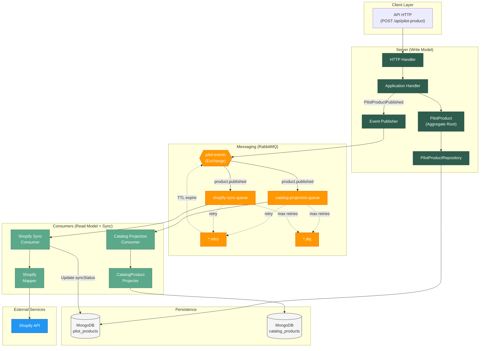

import Tabs from '@theme/Tabs'
import TabItem from '@theme/TabItem'

# Vue d'ensemble de l'architecture

Maison Amane est une application e-commerce construite sur les principes du **Domain-Driven Design (DDD)** et de l'**architecture hexagonale**. Le systeme utilise un pattern **CQRS** (Command Query Responsibility Segregation) avec **event sourcing partiel** pour separer les operations d'ecriture des operations de lecture.

## Diagramme d'architecture



## Composants principaux

<Tabs>
  <TabItem value="server" label="Server (API)" default>

Le serveur HTTP gere les **commandes d'ecriture** (creation/modification de produits).

| Composant | Type | Role | Fichier source |
|-----------|------|------|----------------|
| HTTP Handler | Driving Adapter | Reception des requetes HTTP, validation | [`infrastructure/http/handlers/pilot-product.handler.ts`](https://github.com/maison-amane/maison-amane/blob/main/apps/server/src/infrastructure/http/handlers/pilot-product.handler.ts) |
| Application Handler | Use Case | Orchestration metier, emission d'evenements | [`application/pilot/handlers/create-pilot-product.handler.ts`](https://github.com/maison-amane/maison-amane/blob/main/apps/server/src/application/pilot/handlers/create-pilot-product.handler.ts) |
| PilotProduct Aggregate | Domain | Validation des invariants metier | [`domain/pilot/aggregate.ts`](https://github.com/maison-amane/maison-amane/blob/main/apps/server/src/domain/pilot/aggregate.ts) |
| Event Publisher | Driven Port | Publication des evenements vers RabbitMQ | [`infrastructure/messaging/rabbitmq/event-publisher.ts`](https://github.com/maison-amane/maison-amane/blob/main/apps/server/src/infrastructure/messaging/rabbitmq/event-publisher.ts) |

  </TabItem>
  <TabItem value="consumers" label="Consumers">

Les consumers sont des **driving adapters asynchrones** : ils recoivent des evenements depuis RabbitMQ et declenchent des use cases applicatifs.

| Consumer | Type | Role | Handler source |
|----------|------|------|----------------|
| `catalog-projection` | Driving Adapter | Ecoute `PilotProductPublished`, projette vers CatalogProduct | [`application/catalog/handlers/catalog-projection.handler.ts`](https://github.com/maison-amane/maison-amane/blob/main/apps/server/src/application/catalog/handlers/catalog-projection.handler.ts) |
| `shopify-sync` | Driving Adapter | Ecoute `PilotProductPublished`, synchronise vers Shopify | [`application/shopify/handlers/shopify-sync.handler.ts`](https://github.com/maison-amane/maison-amane/blob/main/apps/server/src/application/shopify/handlers/shopify-sync.handler.ts) |

**Flux** : `RabbitMQ Event → Consumer (driving) → Application Handler → Repository (driven)`

Chaque consumer possede une **queue principale** pour le traitement, une **retry queue** pour les tentatives echouees, et une **DLQ** (Dead Letter Queue) pour les echecs definitifs.

**Fichier d'infrastructure consumer** : [`infrastructure/messaging/rabbitmq/consumer.ts`](https://github.com/maison-amane/maison-amane/blob/main/apps/server/src/infrastructure/messaging/rabbitmq/consumer.ts)

  </TabItem>
  <TabItem value="messaging" label="Messaging">

Le systeme de messaging utilise **RabbitMQ** avec une topologie topic-based.

| Element | Nom | Description |
|---------|-----|-------------|
| Exchange principal | `pilot.events` | Recoit tous les evenements domaine |
| Exchange DLX | `pilot.events.dlx` | Recoit les messages en echec |
| Routing key | `product.published` | Evenement de publication |

**Fichier source** : [`infrastructure/messaging/rabbitmq/topology.ts`](https://github.com/maison-amane/maison-amane/blob/main/apps/server/src/infrastructure/messaging/rabbitmq/topology.ts)

  </TabItem>
</Tabs>

## Principes architecturaux

### CQRS (Command Query Responsibility Segregation)

Le systeme separe :
- **Write Model** : PilotProduct (agregat complet, validation metier)
- **Read Model** : CatalogProduct (projection optimisee pour l'affichage)

Cette separation permet :
- D'optimiser chaque modele pour son usage
- De scaler independamment lecture et ecriture
- D'evoluer les modeles separement

### Event Sourcing partiel

Les evenements domaine (`PilotProductPublished`) sont utilises pour :
- Declencher les projections (Catalog)
- Declencher les integrations (Shopify)
- Assurer la tracabilite (correlationId)

:::note
Le systeme n'implemente pas un event store complet. Les evenements ne sont pas persistes comme source de verite, mais utilises pour la communication asynchrone.
:::

### Architecture hexagonale


#### Structure des ports

**Driven Ports** (`ports/driven/`) : interfaces pour les dependances externes

| Port | Interface | Implementation Dev | Implementation Test |
|------|-----------|-------------------|---------------------|
| Repository | `PilotProductRepository` | MongoDB | In-Memory |
| Event Publisher | `EventPublisher` | RabbitMQ | Spy (mock) |
| Shopify Client | `ShopifyClient` | Fake (mock) | Fake |
| ID Generator | `IdGenerator` | UUID v4 | Deterministic |
| Clock | `Clock` | System time | Fixed time |

**Fichier source** : [`ports/driven/`](https://github.com/maison-amane/maison-amane/tree/main/apps/server/src/ports/driven)

**Driving Ports** (`ports/driving/`) : **vide, et c'est normal**

:::info Pourquoi ports/driving/ est vide ?
Avec Effect-TS, les **application handlers** sont deja des contrats grace au typage structurel :

```typescript
// Ceci EST un contrat implicite :
handlePilotProductCreation: (cmd: CreatePilotProductCommand) =>
  Effect<PilotProduct, DomainError, PilotProductRepository | IdGenerator>
```

Les driving adapters (HTTP handlers, consumers) importent directement ces handlers.

**Pas besoin d'interfaces explicites** sauf si vous avez besoin de :
- Versioning (use case v1 vs v2)
- Multi-tenancy avec logiques differentes
- A/B testing avec swap d'implementations
:::

#### Flux de dependances

```
Requete HTTP ou Event RabbitMQ
        ↓
Driving Adapter (HTTP/Consumer)
        ↓
Application Handler (use case)
        ↓
Domain Model (aggregate)
        ↓
Driven Ports (interfaces)
        ↓
Infrastructure (implementations)
```

## Stack technique

| Couche | Technologie |
|--------|-------------|
| Runtime | Node.js 18+ |
| Langage | TypeScript 5.x |
| Framework fonctionnel | Effect-TS |
| API HTTP | @effect/platform |
| Base de donnees | MongoDB |
| Messaging | RabbitMQ (amqplib) |
| Monorepo | pnpm workspaces + Turborepo |

## Structure du monorepo

```
maison-amane/
├── apps/
│   ├── server/              # API HTTP + domaine
│   ├── client/              # Application front-end
│   └── consumers/
│       ├── catalog-projection/
│       └── shopify-sync/
├── packages/
│   ├── api/                 # DTOs et contrats API partages
│   └── shared-kernel/       # Elements de domaine partages
└── docs/                    # Cette documentation
```
