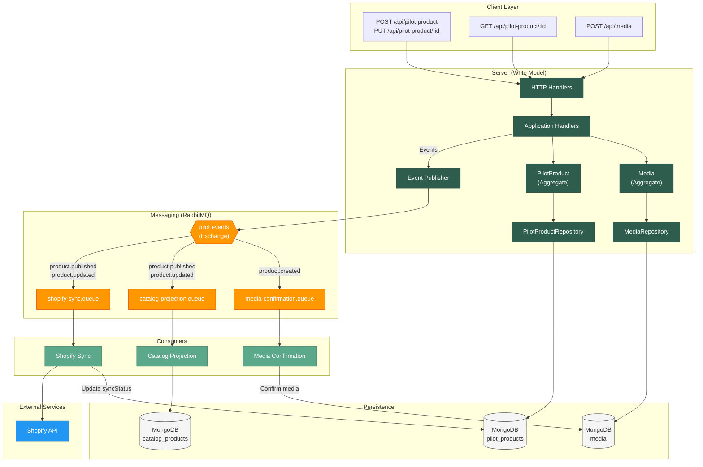
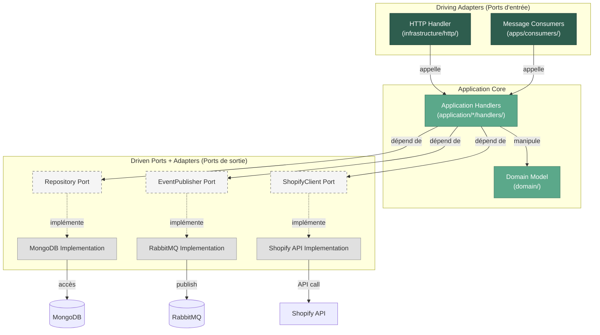

import Tabs from '@theme/Tabs'
import TabItem from '@theme/TabItem'

# Vue d'ensemble de l'architecture

Maison Amane est une application e-commerce construite sur les principes du **Domain-Driven Design (DDD)** et de l'**architecture hexagonale**. Le système utilise un pattern **CQRS** (Command Query Responsibility Segregation) avec **event sourcing partiel** pour séparer les opérations d'écriture des opérations de lecture.

## Diagramme d'architecture



:::tip Gestion des erreurs
Chaque consumer dispose d'un mécanisme de retry automatique et d'une Dead Letter Queue (DLQ). Voir [Gestion des erreurs](./data-flows/error-handling) pour les détails.
:::

## Composants principaux

<Tabs>
  <TabItem value="server" label="Server (API)" default>

Le serveur HTTP gère les **commandes d'écriture** et les **queries de lecture**.

| Composant | Rôle | Endpoints |
|-----------|------|-----------|
| Pilot Product Handlers | Création, mise à jour et consultation de produits | `POST`, `PUT`, `GET /api/pilot-product` |
| Media Handler | Enregistrement de médias (images) | `POST /api/media` |
| Application Handlers | Orchestration métier, émission d'événements | - |
| Event Publisher | Publication des événements vers RabbitMQ | - |

  </TabItem>
  <TabItem value="consumers" label="Consumers">

Les consumers sont des **driving adapters asynchrones** : ils reçoivent des événements depuis RabbitMQ et déclenchent des use cases applicatifs.

| Consumer | Événements écoutés | Rôle |
|----------|-------------------|------|
| `catalog-projection` | `product.published`, `product.updated` | Projette vers CatalogProduct |
| `shopify-sync` | `product.published`, `product.updated` | Synchronise vers Shopify |
| `media-confirmation` | `product.created` | Confirme les médias référencés |

**Flux** : `RabbitMQ Event → Consumer (driving) → Application Handler → Repository (driven)`

  </TabItem>
  <TabItem value="messaging" label="Messaging">

Le système de messaging utilise **RabbitMQ** avec une topologie topic-based.

| Élément | Nom | Description |
|---------|-----|-------------|
| Exchange principal | `pilot.events` | Reçoit tous les événements domaine |
| Routing key | `product.created` | Événement de création |
| Routing key | `product.published` | Événement de publication |
| Routing key | `product.updated` | Événement de mise à jour |

  </TabItem>
</Tabs>

## Principes architecturaux

### CQRS (Command Query Responsibility Segregation)

Le système sépare :
- **Write Model** : PilotProduct (agrégat complet, validation métier)
- **Read Model** : CatalogProduct (projection optimisée pour l'affichage)

Cette séparation permet :
- D'optimiser chaque modèle pour son usage
- De scaler indépendamment lecture et écriture
- D'évoluer les modèles séparément

### Event Sourcing partiel

Les événements domaine sont utilisés pour :
- Déclencher les projections (Catalog)
- Déclencher les intégrations (Shopify)
- Confirmer les médias référencés
- Assurer la traçabilité (correlationId)

:::note
Le système n'implémente pas un event store complet. Les événements ne sont pas persistés comme source de vérité, mais utilisés pour la communication asynchrone.
:::

### Architecture hexagonale



#### Structure des ports

**Driven Ports** (`ports/driven/`) : interfaces pour les dépendances externes

| Port | Interface | Implémentation Dev | Implémentation Test |
|------|-----------|-------------------|---------------------|
| Repository (Pilot) | `PilotProductRepository` | MongoDB | In-Memory |
| Repository (Media) | `MediaRepository` | MongoDB | In-Memory |
| Event Publisher | `EventPublisher` | RabbitMQ | Spy (mock) |
| Shopify Client | `ShopifyClient` | Fake (mock) | Fake |
| ID Generator | `IdGenerator` | UUID v4 | Deterministic |
| Clock | `Clock` | System time | Fixed time |

**Driving Ports** (`ports/driving/`) : **vide, et c'est normal**

:::info Pourquoi ports/driving/ est vide ?
Avec Effect-TS, les **application handlers** sont déjà des contrats grâce au typage structurel :

```typescript
// Ceci EST un contrat implicite :
handlePilotProductCreation: (cmd: CreatePilotProductCommand) =>
  Effect<PilotProduct, DomainError, PilotProductRepository | IdGenerator>
```

Les driving adapters (HTTP handlers, consumers) importent directement ces handlers.

**Pas besoin d'interfaces explicites** sauf si vous avez besoin de :
- Versioning (use case v1 vs v2)
- Multi-tenancy avec logiques différentes
- A/B testing avec swap d'implémentations
:::

#### Flux de dépendances

```
Requête HTTP ou Event RabbitMQ
        ↓
Driving Adapter (HTTP/Consumer)
        ↓
Application Handler (use case)
        ↓
Domain Model (aggregate)
        ↓
Driven Ports (interfaces)
        ↓
Infrastructure (implémentations)
```

Pour la stack technique et la structure du monorepo, voir l'[Introduction](../intro).
